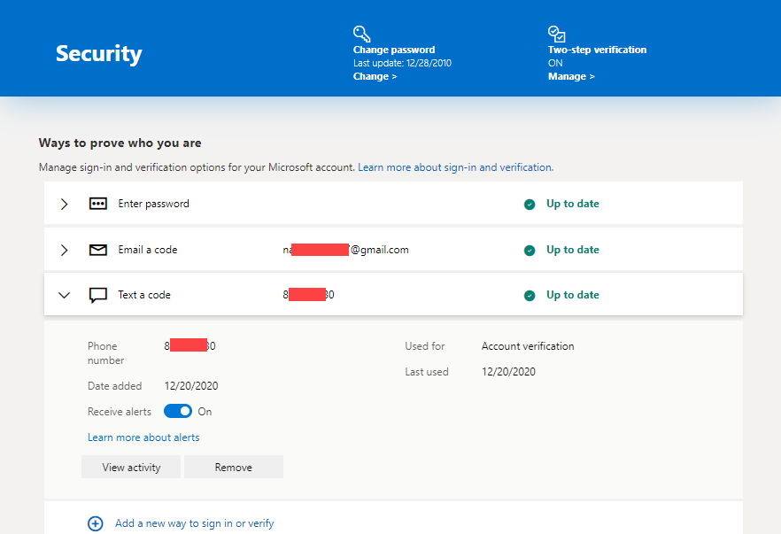

## Outlook 2 Factor
---
### What happens when you turn on two-step verification
If you turn on two-step verification, you’ll get a security code to your email, phone, or authenticator app every time you sign in on a device that isn't trusted. When two-step verification is turned off, you will only have to verify your identity with security codes periodically, when there might be a risk to your account security.

### What you'll need for set up
Two-step verification begins with an email address (we recommend two different email addresses, the one you normally use, and one as a backup just in case), a phone number, or an authenticator app. When you sign in on a new device or from a new location, we'll send you a security code to enter on the sign-in page. For more info about the authenticator app, see How to use the Microsoft Authenticator app.

### Turn two-step verification on or off
1.Go to the Security basics page and sign in with your Microsoft account.

2.Select **More security options**.

3.Under **Two-step** verification, choose **Set up two-step verification** to turn it on, or choose **Turn off two-step verification** to turn it off.

4.Follow the instructions

